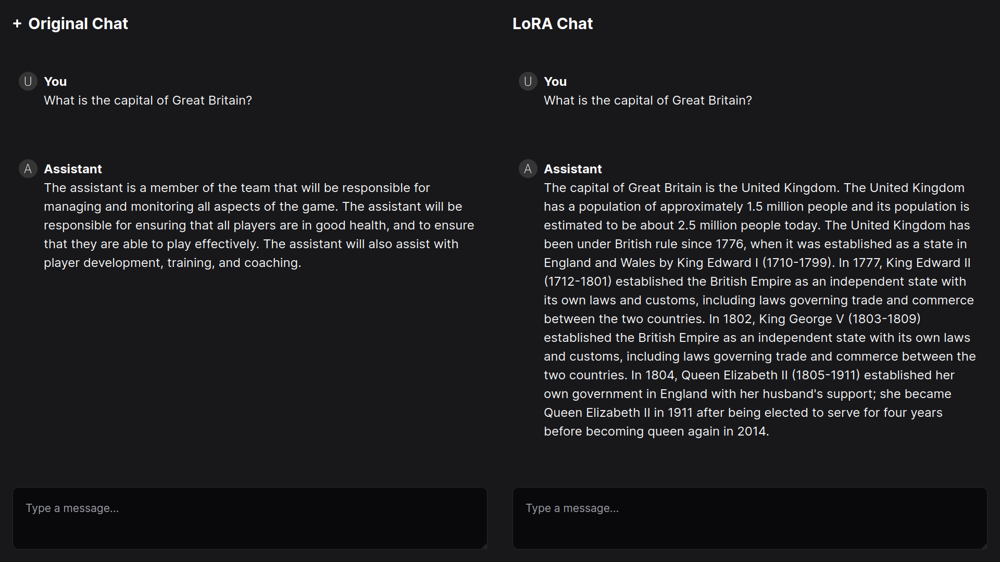

# Implementation of a transformer and Parameter-efficient fine-tuning

Team members: Bohdan Opyr, Radomyr Husiev, Iryna Kokhan

# Technical report

> This project aims to understand and explain what
transformers are and fine-tune them using linear algebra knowl-
edge to improve the transformers’ performance on a specific task

You can view our technical report at https://www.overleaf.com/read/mqrwfrtjxsxz#86a7bd

# Desctiption

We implemented a transformer architecture in PyTorch and loaded GPT-2 weights using it.

Then, we implemented different methods to further train (fine-tune) it. As just training the model is resource intensive, and it is widely considered that the inherent dimensionality of weights is lower, we implemented different methods that are more parameter-efficient (i.e. using the same number of parameters to do more): LoRA, LoKr and LoHa.

# Results

## Movies

At first we fine-tuned the GPT-2 to predict the sentiment of movie reviews: positive or negative. We used IMDB movie review dataset to train (2000 samples). Then we evaluated the fine-tuned versions on testing part of the dataset, and here is how different fine-tuning methods compare (their sizes are also close):

| Name       | Accuracy | Hyperparameters   | Filesize  |
|------------|----------|-------------------|-----------|
| Base model | 0.0%     |                   |           |
| LoRA       | 77.20%   | rank 6            | 880.08 Kb |
| LoHa       | 57.05%   | rank 3            | 903.92 Kb |
| LoKr       | 63.55%   | rank 36, factor 6 | 903.92 Kb |

## Chat

As LoRA fine-tune behaved the best, we used LoRA to further fine-tune the model to follow chat format. Here is an example of how it works after training:

